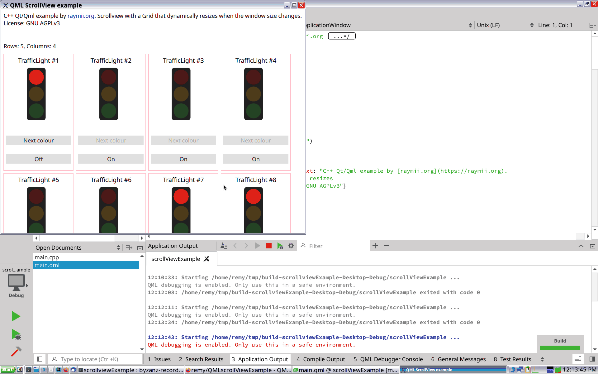

# QML Dynamic scrollview example

In this article I'll show you how to make a responsive layout in Qt / QML that
automatically adjusts the amount of columns and rows based on the window
dimensions, including scrollbars for when the content does not fit inside the
window. This also works if you have a portrait and landscape orientation of
your application, since the screen or window dimensions will be different
across those two builds. I also explain how the dynamic resizing works with
an explanation of property bindings in QML and as a bonus this works on mobile 
(Android/iOS) as well.

Please read the full article on my website:
https://raymii.org/s/articles/Responsive_Qml_layout_with_scrollbars.html
